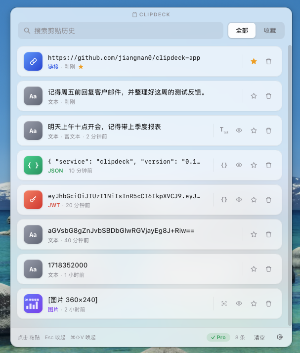
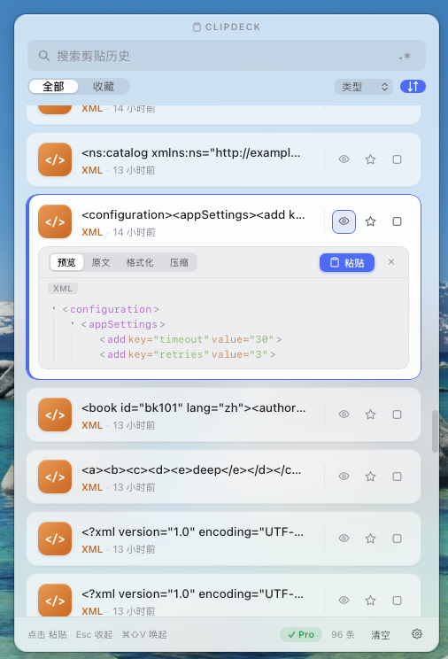
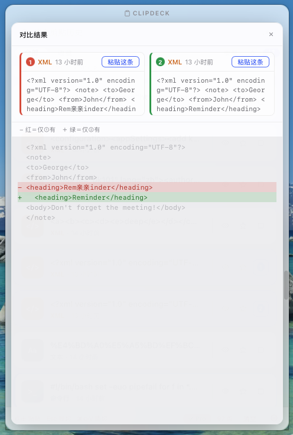

<p align="center"><a href="README.md">🇨🇳 中文</a> · <b>🇬🇧 English</b></p>

<h1 align="center">ClipDeck</h1>

<p align="center">
  <b>A cross-platform clipboard manager for developers · ultra-light · local-first · never touches a server</b>
</p>

<p align="center">
  <b>The Windows installer is just ~3 MB</b> — not a 100 MB+ Electron app.
</p>

<p align="center">
  
</p>

---

## Download

> Public beta (free). Open the latest release below and grab the installer for your OS.
>
> ### 👉 [Latest Release](https://github.com/jiangnan0/clipdeck-app/releases/latest)

| OS | File |
|---|---|
| **Windows** | `ClipDeck-Windows.exe` (recommended) or `.msi` |
| **macOS (Apple Silicon)** | `ClipDeck-macOS.dmg` |

## ⚠️ Seeing an "unidentified developer" / "is damaged" warning?

It's not malware — the beta isn't code-signed yet, so the OS warns. **The app is not actually damaged.** Here's how to open it:

- **Windows**: Blue "Windows protected your PC" → **"More info" → "Run anyway"**.
- **macOS**: "can't be opened / unidentified developer" → right-click the app → **"Open"**, or **System Settings → Privacy & Security → "Open Anyway"**.
- **macOS**: If it says **"is damaged and can't be opened"** — that's just the quarantine flag macOS adds to unsigned apps. Drag the app into **Applications**, then run this once in **Terminal** and open normally:

  ```bash
  xattr -cr /Applications/ClipDeck.app
  ```

> The stable release will be signed/notarized, so these warnings will be gone.

## Features

- **Clipboard history**: text / image / rich text — auto-dedup, most-recent on top, pin favorites.
- **Fast find**: fuzzy + regex search, type filter, sort by time / type / content (asc or desc).
- **Global hotkey**: customizable; one click pastes straight back into your app.
- **Developer formats**: JSON / XML / YAML folding trees, one-click Base64 / JWT / timestamp / URL decoders, SQL / Shell highlight, format / minify.
- **Diff two**: pick two entries for a line-level diff with red/green highlights.
- **Image tools**: zoom, crop, and local OCR — never uploaded.
- **Privacy-first**: skips password-manager content, drops secret tokens, history stays on-device.
- **Cross-device sync (Pro)**: end-to-end encrypted through your own cloud folder — no server involved.

<p align="center">
  
  &nbsp;&nbsp;
  
</p>
<p align="center"><sub>Left: JSON / XML / YAML folding-tree view　·　Right: pick two entries for a line diff</sub></p>

## Privacy

ClipDeck is **local-first and never talks to a server**: your clipboard history stays on your machine; OCR and JSON/JWT processing run fully locally; cross-device sync goes through your own cloud folder with end-to-end encryption — even the author can't see it.

## Feedback & Contact

- **Found a bug or have an idea?** Open an **[Issue](https://github.com/jiangnan0/clipdeck-app/issues)** (screenshots help).
- **Want the full version (cross-device sync, etc.) or a partnership?** Leave an issue and I'll reach out.

Thanks a lot for helping test 🙏

---

<sub>ClipDeck is proprietary software; this repository only distributes installers. © ClipDeck.</sub>
